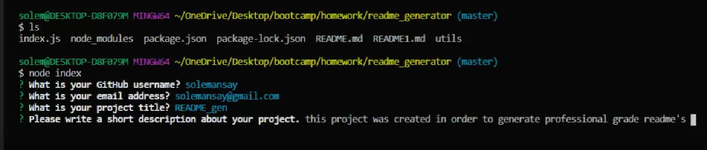

  # README_Generator

  

  ## Description 

  I built this app to generate professional-grade README's through node prompts. When the user is prompted eg, "write a short description" the information that is provided is appended to a document that is also created through the node. 

  

  Once all of the fields are filled out, the user is presented with either a success message or an error code. If an error is pulled the user can view what went wrong, if the success message appears the user has completed the creation of their read me!

  ## Table of Contents 
  
  * [instalation](#instalation)
  * [Usage](#usage)
  * [License](#license)
  * [Contributing](#contributing)
  * [Tests](#tests)
  * [Questions](#questions)
  
  ## Installation 
  
  To install necessary dependancies, run the following command: 
  ```
  npm i
  ```
  ## Usage
  
  Please use this program to generate a professional readme for your newest project. 
  
  ## License
  
  This project is licensed under the MIT license 
  
  ## Contributing
  
  Please pull from the master branch and make pull requests before you attempt to contribute to this repo.
  
  ## Tests
  
  to run tests, run the following command:
  ```
  npm test
  ```

 ## Questions
  
 If you have any questions anout the repo, open an issue or contact me directly at [solemansay](https://github.com/solemansay/). 
 Or send me an email at solemansay@gmail.com

 ```
Thank you for viewing my read me generator project! I hoped you enjoyed my solution and continue to follow my career as a jr full-stack web developer. 
-Soleman Sayeed
```
